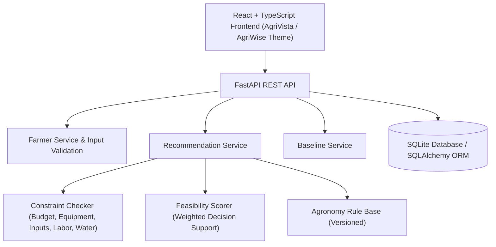

# CropCompass Architecture Specification

## Component Architecture



## Data Flow Diagram

```text
Farmer Profile & Resources
       ↓
Input Validation & Error Reporting
       ↓
Approved/Eligible Rule Filtering (Status: APPROVED, or DEMO if Demo Mode ON)
       ↓
Agronomic Rule Matching (Crop, Variety, Growth Stage)
       ↓
Resource Constraint Checking (Budget, Equipment, Input Quantities, Workers, Water, Local Compatibility)
       ↓
Feasibility Scoring (0–100 Weighted Score)
       ↓
Primary Recommendation (Checks for High-Impact / Human Review)
       ↓
Alternative Search if Primary is Not Feasible (Queries remaining eligible rules)
       ↓
Evidence / "Why this recommendation?" Detailed Breakdown
       ↓
Recommendation History Persistence
```
